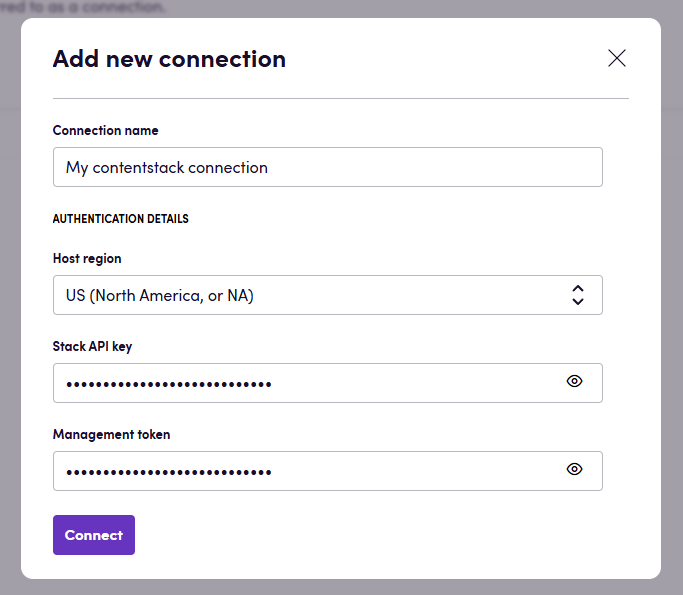

# Blackbird.io Contentstack

Blackbird is the new automation backbone for the language technology industry. Blackbird provides enterprise-scale automation and orchestration with a simple no-code/low-code platform. Blackbird enables ambitious organizations to identify, vet and automate as many processes as possible. Not just localization workflows, but any business and IT process. This repository represents an application that is deployable on Blackbird and usable inside the workflow editor.

## Introduction

<!-- begin docs -->  

Contentstack is a headless CMS technology assembled from a series of best-of-breed solutions. This Contentstack application primarily centers around entry and asset management.

## Before setting up

Before you can connect you need to make sure that:

- You have a Contentstack _Stack API key_: Go to your Contentstack _Stack settings_ and copy API key from the _API Credentials_ section
- You have a Contentstack _Management token_: On the settings page go to _Tokens_, select _Management Tokens_ section and generate API management token with the parameters you need.

## Connecting

1. Navigate to apps and search for Contentstack.
2. Click _Add Connection_.
3. Name your connection for future reference e.g. 'My contentstack connection'.
4. In the _Host region_ field, select your Contentstack region.
5. Fill in the _Stack API key_ and  _Management token_
6. Click _Connect_.
7. Confirm that the connection has appeared and the status is _Connected_.



## Actions

### Assets

- **Download/Upload asset** downloads or uploads content for the asset.

### Content types

- **List content types**

### Entries

- **Get entry** returns details of the specific entry.
- **Get entry string/number/date/boolean property** gets data of the specified entry's property.
- **Set entry string/number/date/boolean property** sets data to the specified entry's property.
- **Search entries** returns a list of entries based on provided filter criterias.
- **Get entry content as HTML** returns entry content converted to an HTML file.
- **Update entry content from HTML** updates entry content from HTML file.
- **Get IDs from HTML** extracts content type and entry IDs from HTML file
- **Publish entry** publish a specific entry based on ID
- **Add tag to entry** adds tag to specific entry
- **Remove tag from entry** removes tag from specific entry

## Events

-   **On asset deleted**
-   **On asset published**
-   **On asset unpublished**
-   **On entry created**
-   **On entry deleted**
-   **On entry published**
-   **On entry unpublished**
-   **On entry updated**


## HTML features

We add metadata to the HTML file to include `Entry ID` and `Content Type ID`. This metadata is used to update the entry content from the HTML file. These tags are used to identify the content in the `Contentstack`, eliminating the need to store IDs elsewhere.

Here is an example of how we include metadata in the HTML file:

```html
<html>
    <head>
        <meta name="blackbird-content-type-id" content="your-content-type">
        <meta name="blackbird-entry-id" content="your-entry-id">
    </head>
    <body>
        <div path="title">Example HTML page</div>
        <div path="description">Blackbird is the new automation backbone for the language technology industry.</div>
    </body>
</html>
```

## Feedback

Do you want to use this app or do you have feedback on our implementation? Reach out to us using the [established channels](https://www.blackbird.io/) or create an issue.

<!-- end docs -->
